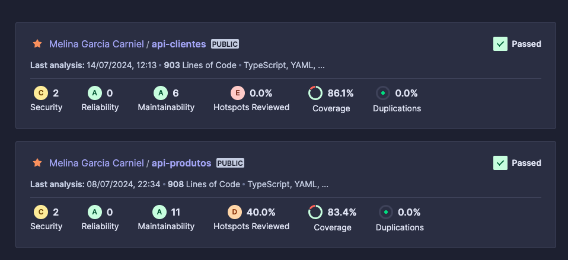
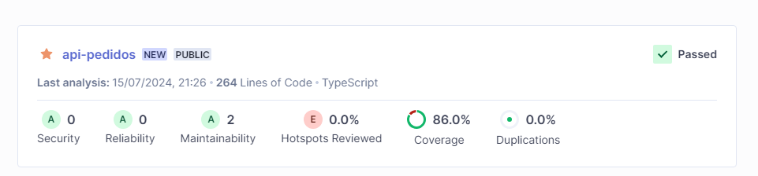
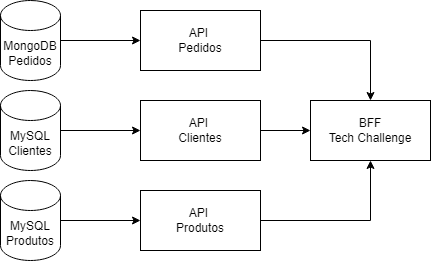
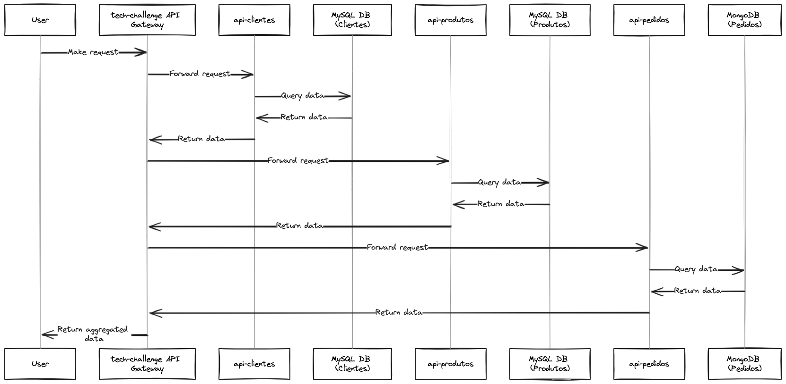

# Tech Challenge - FIAP - Turma 5SOAT

Quarta entrega da Pós de Arquitetura de Software da FIAP.
## Autores

- [Camila Couto](https://github.com/miika07)
- [Melina Carniel](https://github.com/melcarniel)
## Deploy

O deploy é feito através de docker, é necessário rodar o comando 

```bash
  docker-compose up -d
```

## Documentação

**[QUARTA ENTREGA]**

A quarta entrega consiste no uso de microserviços, dividimos em três, sendo API Clientes e Produtos usando bancos de dados MySQL e a API Pedidos usando MongoDB.

https://github.com/melcarniel/api-produtos

https://github.com/melcarniel/api-clientes

https://github.com/miika07/api-pedidos


### Sonar Cloud e testes

Os projetos que criamos para nos apoiar foram APIs de Clientes, Produtos e Pedidos, todos estão rodando com pipelines automatizadas no Sonar Cloud com o mínimo de 80% de coverage.






### Desenhos de Arquitetura

Com essa quarta entrega houve a necessidade de quebrar o nosso antigo monolito em microserviços, que ficaram divididos da seguinte forma:






## Stack utilizada

**Back-end:** Node, Hapi.

**Banco de dados:** Mysql.