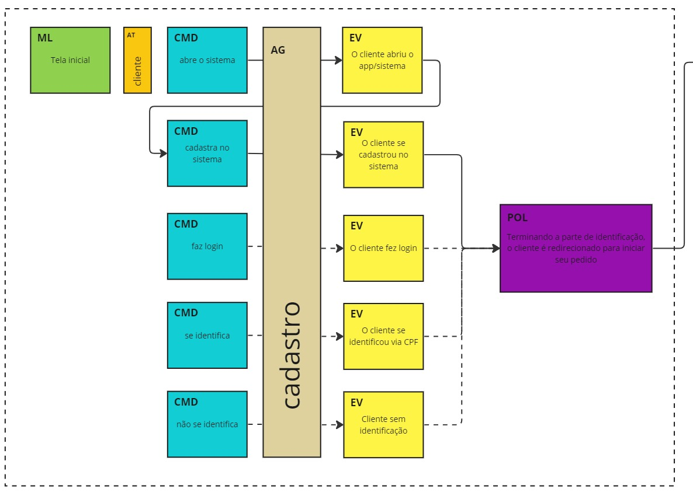
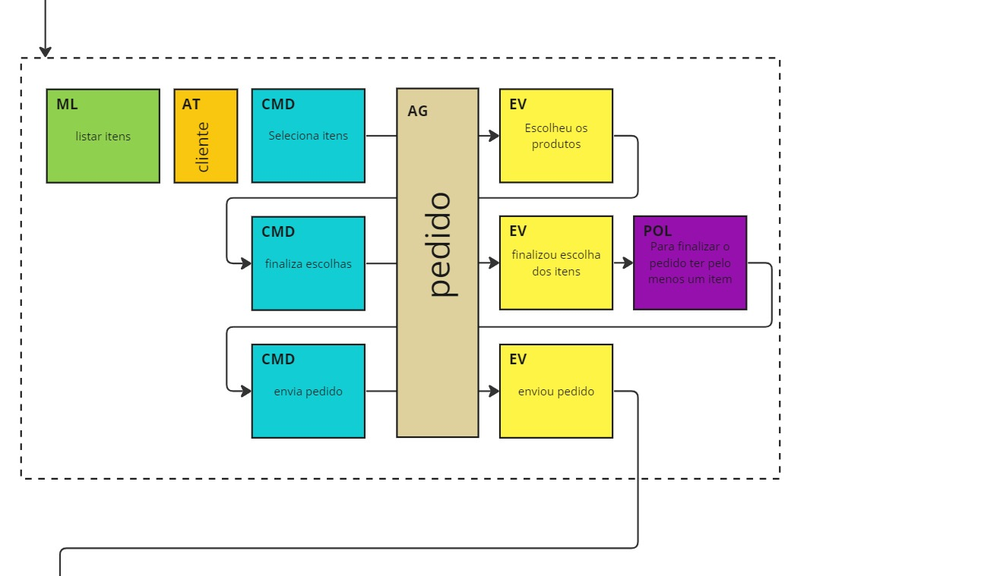
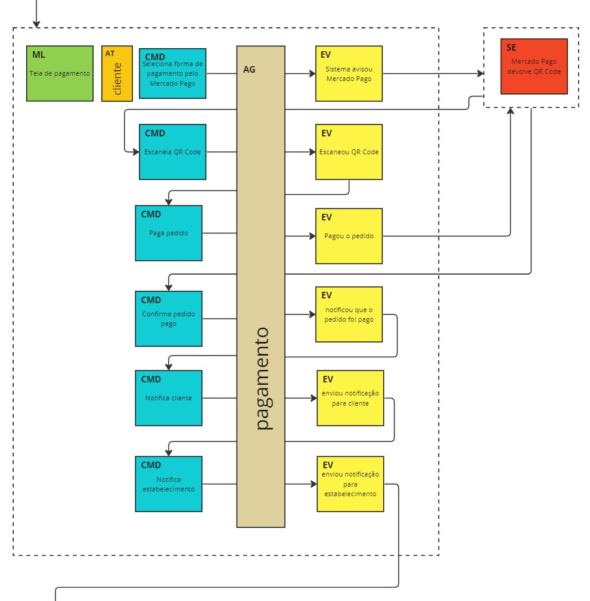
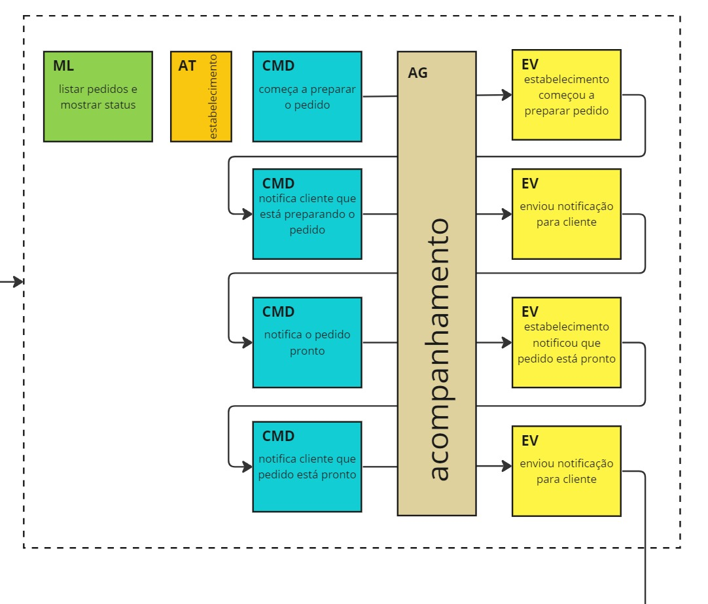
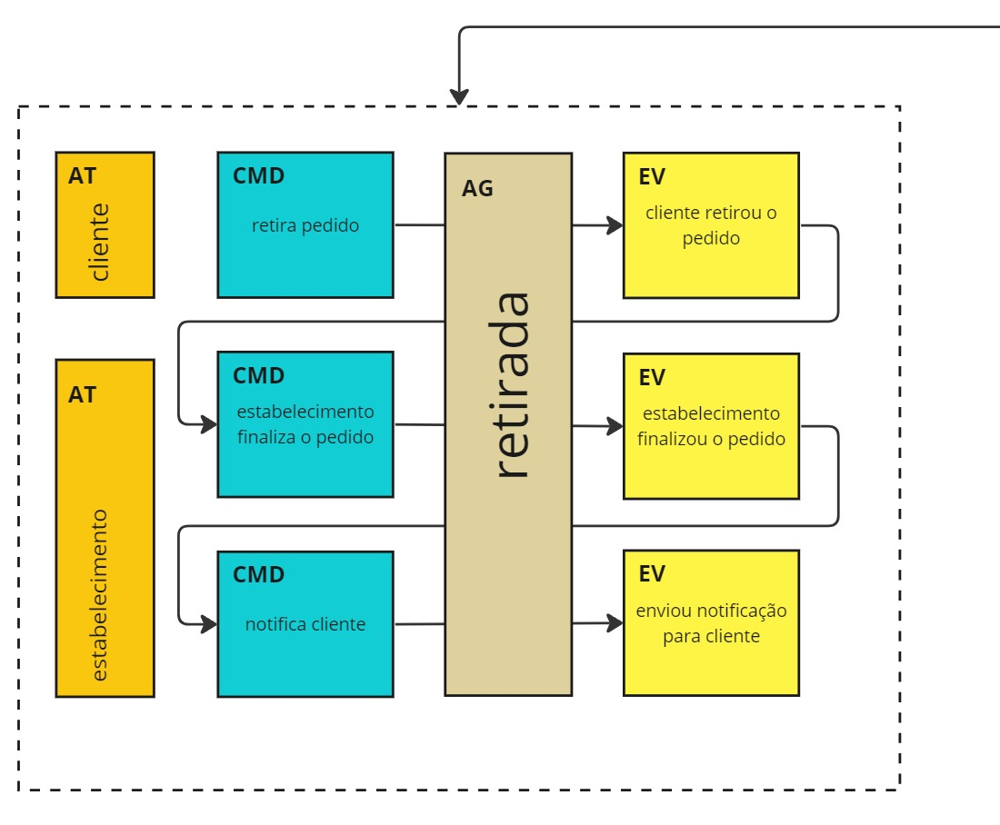

# Tech Challenge - FIAP - Turma 5SOAT

Primeira entrega da Pós de Arquitetura de Software da FIAP.
## Autores

- [Camila Couto](https://github.com/miika07)
- [Melina Carniel](https://github.com/melcarniel)
## Deploy

O deploy é feito através de docker, é necessário rodar o comando 

```bash
  docker-compose up -d
```
<!-- ## Rodando os testes
//TODO - ver como rodar os testes com o docker junto.
Para rodar os testes, rode o seguinte comando

```bash
  npm run test
``` -->
## Documentação

Para a documentação da API usamos Swagger, que pode ser encontrado acessando a url 
[http://localhost:3000/documentation](http://localhost:3000/documentation)


Foram também aplicados os conceitos de DDD para a execução desse projeto e a documentação completa do Eventstorm poderá ser encontrata [aqui](https://miro.com/app/board/uXjVN6Inkus=/).


Abaixo temos a visão final do Eventstorm:






## Stack utilizada

**Back-end:** Node, Hapi.

**Banco de dados:** Mysql.