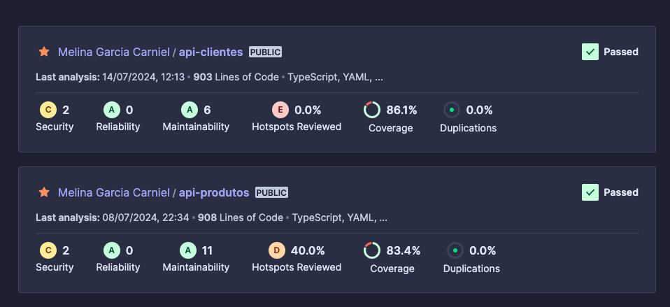
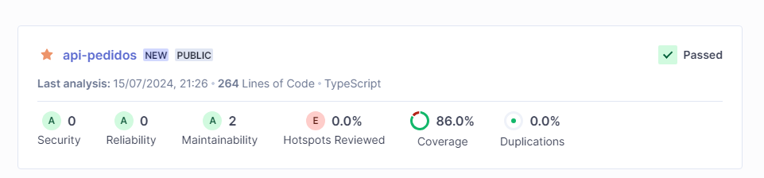
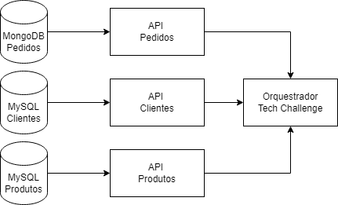
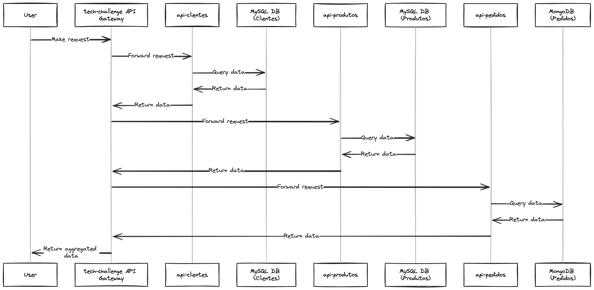

# Tech Challenge - FIAP - Turma 5SOAT

Quarta entrega da Pós de Arquitetura de Software da FIAP.
## Autores

- [Camila Couto](https://github.com/miika07)
- [Melina Carniel](https://github.com/melcarniel)
## Rodando localmente

O projeto roda localmente através de docker, é necessário rodar o comando 

```bash
docker-compose -f docker-compose-local.yml up
```

Para rodar a aplicação NodeJS localmente rode o comando 

```bash
npm run dev
```

Caso queira rodar a aplicação NodeJS também pelo docker, é necessário descomentar a parte **node-app** e não rodar o comando dito anteriormente.

Nosso broker de mensageria é o RabbitMQ e roda na porta 15672 quando executado localmente. 

Para acessar use a url http://localhost:15672/ e adicione o usuário **fiap** e a senha **password**. Dessa forma é possível acompanhar o processamento das mensagens trocadas entre os sistemas.

Para o funcionamento total do projeto, é necessário também usar as nossas outras APIs:

https://github.com/melcarniel/api-produtos

https://github.com/melcarniel/api-clientes

https://github.com/miika07/api-pedidos

## Documentação

**[QUINTA ENTREGA]**

#### SAGA PATTERN

- A quinta etapa do nosso Tech Challenge envolve a aplicação do **SAGA Pattern** para gerenciar transações distribuídas entre os microserviços. Para o sistema de mensageria, optamos pelo RabbitMQ, que está sendo executado dentro do nosso cluster por meio de uma imagem Docker.

- Decidimos usar o padrão de **orquestração** para esta solução, uma vez que já temos um dos microserviços atuando como o ponto centralizador das nossas operações: o projeto [**tech-challenge**](https://github.com/miika07/tech-challenge/tree/quinta-entrega). 
- Esse microserviço é responsável por controlar as chamadas das APIs de pedidos, clientes e produtos, além de gerenciar o fluxo de pagamentos e encaminhar os pedidos para a cozinha. A orquestração nos permite coordenar de forma eficaz as ações entre esses serviços, garantindo consistência nas transações e maior controle sobre as etapas de cada processo.

#### OWASP ZAP

lorem ipsum

#### LGPD
lorem ipsum


### Sonar Cloud e testes

Os projetos que criamos para nos apoiar foram APIs de Clientes, Produtos e Pedidos, todos estão rodando com pipelines automatizadas no Sonar Cloud com o mínimo de 80% de coverage.






### Desenhos de Arquitetura

Nessa entrega foi adicionado o serviço de mensageria que auxilia o nosso orquestrador a avisar quando um pedido foi pago e quando ele deverá ir ou não para a cozinha para ser prepardo.






## Stack utilizada

**Back-end:** Node, Hapi.

**Banco de dados:** Mysql.