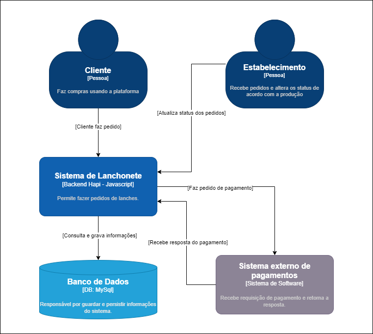

# Tech Challenge - FIAP - Turma 5SOAT

Segunda entrega da Pós de Arquitetura de Software da FIAP.
## Autores

- [Camila Couto](https://github.com/miika07)
- [Melina Carniel](https://github.com/melcarniel)
## Deploy

O deploy é feito através de docker, é necessário rodar o comando 

```bash
  docker-compose up -d
```

## Documentação

**Roteiro de uso [SEGUNDA ENTREGA]**

>Por favor, usar a collection __fluxo - segunda entrega__ que está na collection do POSTMAN

- Primeiro vamos adicionar um cliente, é opcional para criar um pedido, mas nesse fluxo vamos incluir e setar as váriaveis.

- Depois vamos fazer o checkout do pedido, na collection já vai estar setado alguns produtos que incluímos na migration.
Foi adicionado também um status de pagamento nesse payload, onde a gente criar na tabela pagamentos um registro vinculando com o id do pedido. Vamos enviar o status como EM_ANALISE.

- Em seguida tem um uma rota para consultar o status do pagamento, essa rota também já está setada a váriavel com o id do pedido. Consultando agora o resultado deveria ser o mesmo de cima, EM_ANALISE.

- Em seguida vamos chamar o webhook de pagamento, nessa rota vamos mockar o pagamento do pedido, por isso enviamos o status como APROVADO. E dentro desse mock já está atualizando o status do pedido para RECEBIDO caso o pagamento esteja ok.

- Podemos consultar o status do pagamento mais uma vez para confirmar o pagamento.

- Depois podemos listar todos os pedidos que estejam com o status RECEBIDO, EM_PREPARACAO e PRONTO. Vai ser ordenado de acordo com o que foi pedido no challenge.

- E por último temos a rota de atualizar o status do pedido, onde a váriavel do pedido já está setada também.

**Roteiro de uso**

>Antes de iniciar o uso da API, temos algumas informações importantes!

- O projeto conta com uma _collection_ de apoio com o nome de **Tech-challenge.postman_collection.json**, localizada na pasta raiz. 

- Alguns produtos já foram adicionados automatizamente ao subir o projeto, para facilitar o teste.

- As variáveis como id do cliente (_idCliente_) e id do pedido (_idPedido_) gerado ficarão salvos dentro das variáveis da collection após a primeira vez que chamar o endpoint.


**Após a importação da collection, siga o seguinte passo a passo:**

- Abra a collection e entre na pasta _Fluxo_, execute a requisição ```POST adicionar-cliente```, agora seu cliente está criado.

- Após isso, execute a requisição ```POST adicionar_pedido``` para gerar um novo pedido.

- Caso queira verificar o pedido criado, execute a requisição ```GET listar-pedidos```.

- Dentro da pasta _admin_ existem duas requisições, uma é ```GET buscar-pedido-por-status``` que está preparada para buscar todos os pedidos com o status de ```RECEBIDO``` e a outra é o ```POST atualiza-status```, que atualiza o pedido para o status que for definido na requisição, na collection está por padrão o status ```FINALIZADO```.


Caso queira todos os endpoints do projeto, pode ser encontrado acessando a url 
[http://localhost:3000/documentation](http://localhost:3000/documentation), construída usando o [Swagger](https://swagger.io).

### Desenhos de Arquitetura

O sistema foi projetado para rodar em arquitetura Cloud, usando serviços da AWS seguindo a seguinte premissa: 


Utilizamos também o modelo C4 de nível 1 para abstrair a arquitetura e representar como os nossos stakeholders se comunicam com o sistema.



### EventStorm

Foram aplicados os conceitos de DDD para a execução desse projeto e a documentação completa do Eventstorm poderá ser encontrata [aqui](https://miro.com/app/board/uXjVN6Inkus=/).


Abaixo temos a visão final do Eventstorm:


## Stack utilizada

**Back-end:** Node, Hapi.

**Banco de dados:** Mysql.